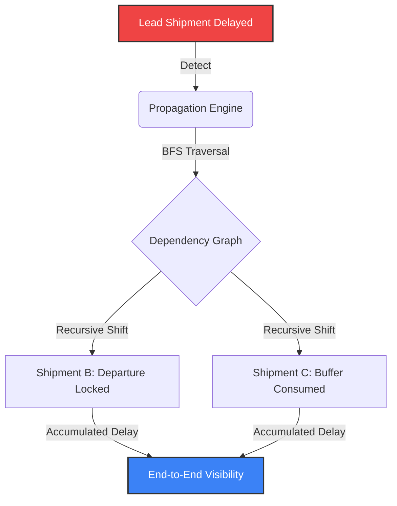
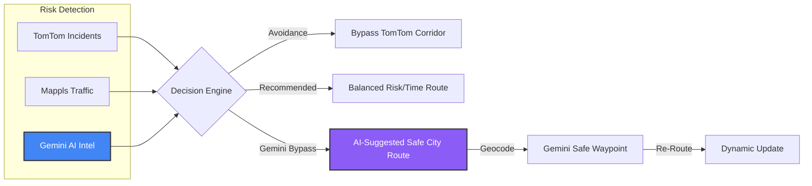

# 🚀 Smart Supply Chain Intelligence Platform

> **Google Solution Challenge 2026** — A high-fidelity, AI-powered mission control for **Resilient Logistics and Dynamic Supply Chain Optimization**. Designed to preemptively detect disruptions and neutralize cascading delays across complex transportation networks.

<p align="center">
  
  
  
  
  
  
</p>

---

## 🧠 Problem Statement Alignment

**Primary Objective:** *Resilient Logistics and Dynamic Supply Chain Optimization*

Modern global supply chains manage millions of concurrent shipments across volatile networks. Critical transit disruptions—from sudden weather events to hidden operational bottlenecks—are chronically identified only after delivery timelines are already compromised.

This platform solves this by providing a **Scalable Intelligence Layer** that:
1.  **Detects Preemptively:** Uses Gemini AI + Multi-source Telemetry to flag risks *before* they become bottlenecks.
2.  **Neutralizes Cascades:** Identifies localized delays and calculates their recursive impact across the entire dependent supply chain.
3.  **Optimizes Dynamically:** Executes high-fidelity route adjustments in real-time to preserve delivery integrity.

---

---

## 🎯 What It Does

The platform continuously monitors every active shipment in real time, scores risk across **5 weighted factors**, and autonomously reroutes trucks **before delays occur**.

### The Core Intelligence Loop

```
Create Shipment → Geocode → Route (Mappls) → Ai(Gemini) relevent waypoint location web searching → Risk Engine (6 Factors)
       ↓                                            ↓
   Store in MongoDB ←── Background Scheduler (5 min) ──→ WebSocket Alert
       ↓                                            ↓
   GPS Simulation ←── Cascade Propagation           Auto-Reroute Decision
       ↓                                            ↓
   Shipment Detail Panel ←── Countdown Timer (120s)  ──→ Execute Reroute
```

---

## ⚙️ Tech Stack

| Layer | Technology | Purpose |
|-------|-----------|---------|
| **Backend** | FastAPI (Python 3.12, async) | REST API + WebSocket server |
| **AI Tech** | Google Gemini API | Gemini 2.5 Flash |
| **Database** | MongoDB Atlas (Motor async driver) | Persistent shipment, risk, notification storage |
| **Frontend** | React 19 + Vite + TailwindCSS | Glassmorphic dashboard with dark/light themes |
| **Maps** | Leaflet + React-Leaflet | Interactive shipment tracking visualization |
| **Real-time** | Native WebSockets + APScheduler | Live alerts, countdown timers, GPS updates |
| **Routing** | Mappls (MapmyIndia) API | OAuth2 routing, real-time traffic, alternatives |
| **Weather** | Open-Meteo API | Time-aware hourly forecasts per waypoint |
| **Road Intel** | Gemini 2.5 Flash + Google Search Grounding | Real-time road disturbance detection |
| **Incidents** | TomTom Traffic API | Live road incidents (accidents, closures, jams) |
| **Geocoding** | Nominatim (OSM) | Free place name ↔ coordinate resolution |
| **State Mgmt** | Zustand + React Query | Client-side stores + server-state cache |
| **Animations** | Framer Motion | Micro-interactions, page transitions |

---

## ✨ Core Features

### 1. 🗺️ Intelligent Shipment Creation
- Geocode origin, destination, and up to 5 intermediate **via points** (waypoints)
- Each waypoint supports configurable **dwell time** (stop duration: 15 min – 2 hr) for loading/unloading
- Dwell times are factored into the total ETA calculation, not just travel time
- Shipments can declare **upstream dependencies** — "this shipment can only depart after shipment X arrives"
- Auto-reroute toggle enables autonomous decision-making on HIGH/CRITICAL risk

### 2. 🧮 5-Factor Weighted Risk Engine
Risk is calculated across **5 independent factors** with weighted contributions:

```
Final Score = (Weather × 35%) + (Events × 25%) + (Traffic × 20%)
            + (Time Buffer × 15%) + (Historical × 5%)
```

| Factor | Weight | Source | What It Measures |
|--------|--------|--------|-----------------|
| **Weather** | 35% | Open-Meteo | Rain, wind speed, visibility at each waypoint at the truck's **estimated arrival time** (not current weather) |
| **Events** | 25% | TomTom Traffic | Live road incidents — accidents, closures, flooding, road works — matched to a 200m corridor around the route |
| **Traffic** | 20% | Mappls | Real-time duration vs free-flow ratio (1.0x = clear, 2.0x+ = gridlock) |
| **Time Buffer** | 15% | Calculated | How much of the journey has elapsed vs expected ETA (overdue = high risk) |
| **Major Incident/News** | 5% | Gemini 2.5 Flash | AI-powered web search for strikes, protests, road closures along route cities |

**Risk Levels:** `LOW` (0–30) · `MEDIUM` (30–60) · `HIGH` (60–85) · `CRITICAL` (85–100)

### 3. 🔄 Autonomous Rerouting Engine
When risk escalates to HIGH or CRITICAL:
1. **120-second countdown** begins (broadcast live via WebSocket)
2. System computes up to **5 alternative routes**:
   - **Recommended** — best balance of risk vs travel time
   - **Fastest** — shortest duration
   - **Safest** — lowest risk score
   - **Avoidance** — routes around specific TomTom-detected incidents
   - **Gemini Route** — AI-suggested bypass via a safe city (geocoded from Gemini's recommendation)
3. If user doesn't cancel within 120s → **auto-executes** the Recommended route
4. On CRITICAL risk, the **Gemini Route** (if available) is preferred over Recommended

### 4. 🔗 Cascade Dependency Graph
- Shipments can form **parent → child dependency chains**
- When a parent shipment is delayed, the delay **recursively propagates** to all downstream children (BFS traversal, max depth 5)
- Each child's `scheduled_departure` is shifted by the accumulated delay
- Cascade alerts are broadcast via WebSocket in real time
- The **CascadePanel** UI component visualizes the dependency tree with delay exposure hours

### 5. ⏱️ Dwell Time & ETA Breakdown
- Each via point has an optional `stop_duration_minutes` field (loading/unloading time)
- Total dwell time is **added to the travel duration** when computing ETA
- The backend uses **Mappls leg durations** to compute per-waypoint ETA breakdowns
- Each via point stores its own `eta_arrival` timestamp
- The **ShipmentDetailPanel** renders a full visual timeline:
  - 🟢 Origin Node (with departure time)
  - 🔵 Via Nodes (with ETA + orange dwell badges)
  - 🔴 Target Destination (with final ETA)

### 6. 🧪 Scenario Lab (What-If Simulator)
A sandboxed simulation environment that **never touches production data**:
- Select any active shipment → inject a disruption (Storm / Traffic / Blockage) at Low / Medium / High severity
- Runs through the **real risk engine** pipeline with scenario overrides
- Computes alternative routes with AI scoring
- Shows Human vs AI decision comparison (delay reduction %, risk reduction)
- 10-second countdown with Accept / Cancel controls
- All simulation state stored in `simulation_decisions` collection (separate from production `decisions`)

### 7. 🔔 Real-Time Notification System
Multi-channel alert system with intelligent delivery:

| Alert Type | Trigger | Severity |
|-----------|---------|----------|
| `risk_alert` | Risk level changed | Matches risk level |
| `countdown_started` | Auto-reroute countdown begins | High |
| `reroute_executed` | Route automatically changed | Critical |
| `cascade_alert` | Downstream shipment delayed | High |
| `gps_stuck` | GPS hasn't moved for 15+ min | High |
| `api_failure` | External API (weather/Gemini) failed | Medium |
| `road_disturbance` | Gemini detected road closure/protest | Critical/High |

**Delivery channels:**
- Toast popups (bottom-right, auto-dismiss by severity)
- Desktop notifications (critical/high only)
- Sound alerts (configurable volume)
- Notification panel (persistent history with snooze/acknowledge)
- All alerts carry a `source` field (`REAL_SYSTEM` vs `SIMULATOR`) — frontend never mixes them

### 8. 🗺️ Live Map Visualization
- Leaflet-based map with real-time truck position tracking
- Route polylines decoded from Mappls geometry
- Road incident markers (TomTom) with severity icons
- Disruption zones visualized during Scenario Lab simulations
- 5x hyper-lapse GPS simulation for demo purposes

### 9. 📊 Analytics Dashboard
- Aggregated stats: total shipments, active, risk distribution
- Risk history charts per shipment
- Conditions monitoring (weather, traffic)
- Single API call (`/api/dashboard`) for all dashboard data

---

## 📐 Intelligent Workflows

### 1. Cascading Propagation Logic
The system prevents "blind delays" by recursively calculating how a single disruption affects the entire downstream chain.



### 2. Multi-Vector Rerouting Decision
When risk escalates, the system computes distinct alternatives based on multifaceted telemetry.



---

## 🏗️ Project Structure

```
backend/
├── main.py                          # FastAPI app, CORS, rate limiting, lifespan
├── database.py                      # MongoDB Motor async client
├── models.py                        # Pydantic schemas (ViaPoint, ShipmentCreate, DecisionCreate...)
│
├── routers/
│   ├── shipments.py                 # CRUD + geocoding + ETA with dwell time + cascade deps
│   ├── risk.py                      # On-demand risk computation endpoint
│   ├── risk_engine.py               # 5-factor weighted risk calculation engine
│   ├── reroute.py                   # GET /api/reroute/{id} — trigger alternative routes
│   ├── reroute_engine.py            # Mappls alternatives + avoidance + Gemini bypass routes
│   ├── incidents.py                 # TomTom incident fetching, corridor filtering, caching
│   ├── cascade.py                   # BFS dependency graph traversal with cycle detection
│   ├── scenario.py                  # Scenario Lab — sandboxed simulation environment
│   ├── dashboard.py                 # Aggregated stats for dashboard
│   ├── notifications.py             # Notification CRUD + read/snooze
│   └── websocket.py                 # WS /ws/alerts endpoint
│
├── core/
│   ├── scheduler.py                 # APScheduler — GPS sim, risk recompute, cascade propagation
│   ├── websocket_manager.py         # Connection manager + broadcast to all clients
│   ├── countdown_manager.py         # Auto-reroute countdown state + broadcast
│   ├── event_factory.py             # Strict WebSocket message contract factory
│   └── metrics.py                   # In-memory operational metrics
│
├── services/
│   ├── mappls_service.py            # OAuth2 token + routing + traffic + alternatives
│   ├── geocoding_service.py         # Nominatim reverse geocoding (coords → city names)
│   ├── weather_service.py           # Open-Meteo time-aware forecasts per waypoint
│   ├── gemini_service.py            # Gemini 2.5 Flash + Google Search grounding
│   ├── segment_service.py           # Waypoint → city names (for Gemini context)
│   ├── scoring_thresholds.py        # Risk weight constants and thresholds
│   ├── cache.py                     # In-memory TTL cache for API responses
│   └── ors_service.py               # OpenRouteService fallback
│
└── utils/
    └── geo.py                       # Haversine distance calculation

frontend/src/
├── App.jsx                          # Root component
├── main.jsx                         # React entry point
├── index.css                        # Global styles + design tokens
│
├── pages/
│   ├── Dashboard.jsx                # Main analytics dashboard
│   ├── Shipments.jsx                # Shipment table + map + detail panel
│   ├── ScenarioLab.jsx              # What-if simulation interface
│   ├── Analytics.jsx                # Charts and trends
│   ├── Settings.jsx                 # Notification preferences
│   └── ...
│
├── components/ui/
│   ├── CreateShipmentModal.jsx      # Shipment creation with via points + dwell time
│   ├── ShipmentDetailPanel.jsx      # Slide-in panel with ETA breakdown timeline
│   ├── RerouteModal.jsx             # Alternative route selection with risk comparison
│   ├── RiskBreakdown.jsx            # Expandable 5-factor risk analysis
│   ├── CascadePanel.jsx             # Dependency graph visualization
│   ├── CountdownBar.jsx             # Auto-reroute countdown timer
│   ├── LiveAlertPanel.jsx           # Real-time toast notification system
│   ├── AlertItem.jsx                # Individual alert with severity styling
│   ├── DecisionPanel.jsx            # AI decision display (Scenario Lab)
│   ├── LocationAutocomplete.jsx     # City search with autocomplete
│   └── ...
│
├── hooks/
│   ├── useShipments.js              # React Query hooks for shipment CRUD
│   ├── useAlertWebSocket.js         # WebSocket connection + alert routing
│   └── useDashboard.js              # Dashboard data fetching
│
├── stores/
│   ├── alertStore.js                # Zustand — real vs sim alerts, popups, snooze
│   ├── shipmentStore.js             # Zustand — shipment list cache
│   ├── countdownStore.js            # Zustand — active countdown timers
│   ├── notificationPrefsStore.js    # Zustand — sound, desktop, toast preferences
│   └── uiStore.js                   # Zustand — theme, sidebar, modal state
│
├── api/
│   └── apiClient.js                 # Axios instance with base URL
│
└── router/
    └── index.jsx                    # React Router with lazy loading
```

---

## 🚀 Quick Start

### Prerequisites
- Python 3.11+
- Node.js 18+
- MongoDB Atlas cluster (or local MongoDB)

### 1. Clone & Install Backend

```bash
git clone https://github.com/your-repo/Smart-Supply-Chain-Intelligence-Platform.git
cd Smart-Supply-Chain-Intelligence-Platform/backend

python -m venv venv
venv\Scripts\activate          # Windows
# source venv/bin/activate     # Mac/Linux

pip install -r requirements.txt
```

### 2. Configure Environment

Create `backend/.env`:

```env
MONGODB_URI=mongodb+srv://<user>:<pass>@cluster.mongodb.net/
DB_NAME=supply_chain
MAPPLS_CLIENT_ID=your_mappls_client_id
MAPPLS_CLIENT_SECRET=your_mappls_client_secret
GEMINI_API_KEY=AIzaSy...
TOMTOM_KEY=your_tomtom_api_key
```

### 3. Start Backend

```bash
cd backend
uvicorn main:app --reload
# API running at http://localhost:8000
# Docs at http://localhost:8000/docs
```

### 4. Start Frontend

```bash
cd frontend
npm install
npm run dev
# App running at http://localhost:5173
```

---

## 📡 API Reference

### Shipments

| Method | Endpoint | Description |
|--------|----------|-------------|
| `POST` | `/api/shipments` | Create shipment — geocodes, routes, computes ETA with dwell time |
| `GET` | `/api/shipments` | List all shipments (optional `?status=` filter) |
| `GET` | `/api/shipments/{id}` | Get single shipment with full risk data |
| `PATCH` | `/api/shipments/{id}` | Update location / status / auto-reroute flag |
| `DELETE` | `/api/shipments/{id}` | Delete shipment |

### Risk & Rerouting

| Method | Endpoint | Description |
|--------|----------|-------------|
| `GET` | `/api/risk/{id}` | Compute fresh 5-factor risk score |
| `GET` | `/api/reroute/{id}` | Get 3-5 alternative routes with risk comparison |
| `GET` | `/api/reroute/{id}/assess` | Full weather + traffic scoring for alternatives |

### Incidents & Cascade

| Method | Endpoint | Description |
|--------|----------|-------------|
| `GET` | `/api/shipments/{id}/incidents` | Live road incidents on route (TomTom) |
| `GET` | `/api/shipments/{id}/cascade` | Dependency graph — all downstream affected shipments |

### Scenario Lab

| Method | Endpoint | Description |
|--------|----------|-------------|
| `POST` | `/api/scenario/run` | Run simulation (storm/traffic/blockage × severity) |
| `POST` | `/api/scenario/accept` | Accept AI recommendation in simulation |
| `POST` | `/api/scenario/cancel` | Cancel simulation countdown |

### Notifications

| Method | Endpoint | Description |
|--------|----------|-------------|
| `GET` | `/api/notifications` | Paginated notification history |
| `PATCH` | `/api/notifications/{id}/read` | Mark notification as read |

### Real-Time

| Protocol | Endpoint | Description |
|----------|----------|-------------|
| `WS` | `/ws/alerts` | Live alerts — risk changes, countdowns, reroutes, cascades |

### Dashboard

| Method | Endpoint | Description |
|--------|----------|-------------|
| `GET` | `/api/dashboard` | All dashboard stats in a single call |

---

## ⚡ Background Scheduler

Every **5 minutes**, the scheduler processes all active shipments:

```
┌─────────────────────────────────────────────────────────────────┐
│  1. GPS Simulation    — Interpolate truck along route waypoints │
│  2. Delay Detection   — Compare projected ETA to original_eta  │
│  3. Risk Recompute    — Run full 5-factor engine                │
│  4. Incident Refresh  — Refresh TomTom incidents (background)   │
│  5. GPS Stuck Check   — Alert if no movement for 15+ min       │
│  6. Cascade Propagate — Push parent delays to all children      │
│  7. Auto-Reroute      — Start 120s countdown if HIGH/CRITICAL   │
│  8. WebSocket Alert   — Broadcast if risk level changed         │
└─────────────────────────────────────────────────────────────────┘
```

**Gemini API conservation:** Gemini is called only once at shipment creation (2-stage: fast → deep assessment). Scheduled ticks use cached Gemini scores to conserve API quota.

---

## 🔌 WebSocket Protocol

Connect once from the frontend:
```
ws://localhost:8000/ws/alerts
```

### Message Types

```json
{
  "type": "risk_alert",
  "source": "REAL_SYSTEM",
  "timestamp": "2026-04-28T14:32:00Z",
  "shipment_id": "68a1b2c3d4e5f6...",
  "shipment_name": "Mumbai-Delhi Express",
  "level": "high",
  "message": "Storm warning detected on NH48 near Vadodara",
  "score": 78.4,
  "primary_driver": "weather",
  "previous_level": "medium",
  "auto_rerouted": false
}
```

All 10 message types: `risk_alert` · `countdown_started` · `countdown_update` · `countdown_cancelled` · `reroute_executed` · `decision_triggered` · `scenario_update` · `gps_stuck` · `api_failure` · `cascade_alert`

Every message has `source: "REAL_SYSTEM" | "SIMULATOR"` — the frontend **never mixes** simulation alerts into production views.

Send `"ping"` → server responds `{"type": "pong"}`.

---

## 🗺️ External APIs

### Mappls (MapmyIndia)
- **Auth:** OAuth2 client_credentials (token auto-refreshes every 58 min)
- **Used for:** Routing with traffic, waypoints every 50km, leg durations, road names (NH48, SH17), alternative corridors
- **Credentials:** [developer.mappls.com](https://developer.mappls.com)

### Open-Meteo
- **Auth:** None (free, no API key)
- **Used for:** Hourly weather forecasts — picks values at the truck's **estimated arrival time** per waypoint, not current weather

### Gemini 2.5 Flash
- **Auth:** API key from [aistudio.google.com](https://aistudio.google.com)
- **Used for:** Real-time road disturbance detection using `google_search` grounding — searches for strikes, protests, road closures along route cities
- **Returns:** Risk score + incident location + safe bypass waypoint

### TomTom Traffic
- **Auth:** API key from [developer.tomtom.com](https://developer.tomtom.com)
- **Used for:** Real-time road incidents — accidents, closures, flooding, road works, jams
- **Filtering:** 200m corridor around the route polyline, deduplication, severity scoring

### Nominatim (OpenStreetMap)
- **Auth:** None (free, no API key)
- **Used for:** Place → coordinates (geocoding) and coordinates → city names (reverse geocoding for Gemini context)

---

## 🛡️ Safety & Data Isolation

The platform enforces strict separation between production and simulation:

| Concern | Production | Simulation |
|---------|-----------|------------|
| **Collection** | `decisions` | `simulation_decisions` |
| **Source tag** | `REAL_SYSTEM` | `SIMULATOR` |
| **Modifies shipments?** | ✅ Yes (reroutes) | ❌ Never |
| **Safety check** | — | `system_mode == "REAL"` → HTTP 403 |

---

## 📐 Architecture Diagram

```
                    ┌──────────────────────────┐
                    │      React Frontend      │
                    │  (Vite + Leaflet + Zustand)│
                    └────────────┬─────────────┘
                                 │  REST + WebSocket
                    ┌────────────▼─────────────┐
                    │    FastAPI Backend        │
                    │  (async, rate-limited)    │
                    └──┬──────┬──────┬──────┬──┘
                       │      │      │      │
              ┌────────▼──┐ ┌─▼────┐│ ┌────▼────────┐
              │  Mappls   │ │Gemini││ │  TomTom     │
              │ (routing) │ │(AI)  ││ │ (incidents) │
              └───────────┘ └──────┘│ └─────────────┘
                              ┌─────▼──────┐
                              │ Open-Meteo │
                              │ (weather)  │
                              └────────────┘
                    ┌────────────┬─────────────┐
                    │         MongoDB          │
                    │  shipments │ notifications │
                    │  decisions │ dependencies  │
                    │  simulation_decisions     │
                    └───────────────────────────┘
                    ┌───────────────────────────┐
                    │   APScheduler (5 min)     │
                    │  GPS sim → Risk → Alert   │
                    │  → Cascade → Auto-Reroute │
                    └───────────────────────────┘
```

---

## 👤 Target Users

| Role | Use Case |
|------|----------|
| **Logistics Operations Manager** | Monitor fleet, approve reroutes, manage risk |
| **Dispatcher** | Track shipments, respond to alerts |
| **Supply Chain Planner** | Run what-if simulations, analyze dependencies |
| **Monitoring Team** | Review notification history, assess incidents |

---

## 👥 Team

| Name | Role |
|------|------|
| **Veer** | Backend — FastAPI, risk engine, Mappls, Gemini, scheduler, cascade engine |
| **Nandani** | Frontend — React, Leaflet map, dashboard, WebSocket, UI/UX | Simulation & backend assistance |

---

## 📜 License

MIT
